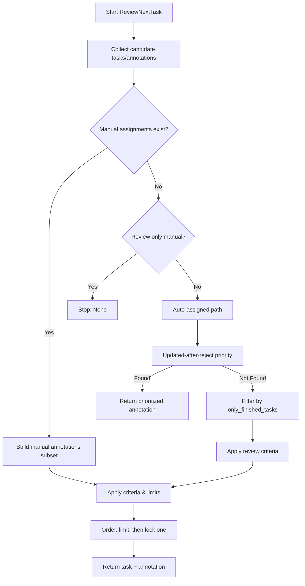

# Review Stream: Annotation Review Task Selection

## Overview

This document consolidates the reviewer flow based on `label_studio_enterprise/reviews/views/api.py` (notably `ReviewNextTaskAPI`) and related settings. It describes how the system selects the next annotation for review, including:

- Inputs and project review settings
- Manual vs auto-assigned review
- Selection criteria depending on review policy
- Ordering and limits
- Reject-updated prioritization
- Locking to prevent collisions

## Key Concepts and Entities

- **Annotation Review**: Accept/Reject (plus optional comments) for a specific annotation.
- **Review criteria**: One of the policy values defined in `ReviewSettings`:
  - `REVIEW_CRITERIA_ONE`: Mark task reviewed after at least one accepted annotation.
  - `REVIEW_CRITERIA_ALL`: Mark task reviewed after every annotation in the task is processed.
- **Manual assignment**: Annotations explicitly assigned to a reviewer via assignments of type `REVIEW`.
- **Auto-assignment**: The system selects eligible annotations to review.
- **Only finished tasks**: Option to restrict review to tasks that are labeled/complete for labeling.
- **Updated after reject**: Prioritize annotations that have been updated following a rejection.

## Inputs to the Review Engine

- `user`: Current reviewer.
- `project`: Current project and its `review_settings`.
- `request.data`: May include `selectedItems`, indicating a Data Manager subset and ordering.
- Feature flags: Several flags toggle optimized queries and ordering behaviors.

## High-Level Flow



## Detailed Steps and Rules

1. Determine base scope
   - If `selectedItems` are provided, use `get_prepared_queryset` to build task scope and subset of annotations in that scope.
   - Otherwise, default to the project-wide task set (filtered by permissions and optionally by `only_finished_tasks`).

2. Manual vs. Auto
   - If reviewer has manual assignments and manual subset has eligible annotations, take the manual path first.
   - If there are no manual eligible annotations and `review_only_manual_assignments` is enabled, stop with "No more annotations".
   - Otherwise proceed with the auto path.

3. Updated-after-reject priority (Enterprise)
   - When enabled by feature flag, prefer annotations that were updated following a reject. This provides fast feedback loops on corrections.

4. Only finished tasks
   - If `only_finished_tasks` is enabled, restrict the scope to tasks that are labeling-complete (`is_labeled=True`).
   - Enterprise agreement threshold (optimized path): Optionally limit tasks to those meeting agreement thresholds or sufficient annotator counts.

5. Apply review criteria
   - `REVIEW_CRITERIA_ONE`:
     - Exclude tasks that already have an accepted review for any of their annotations.
     - Consider remaining annotations for these tasks.
   - `REVIEW_CRITERIA_ALL`:
     - Include tasks that still have at least one annotation with no review.
     - Exclude annotations already reviewed by this reviewer.

6. Ordering and limits
   - Order by task and annotation id (or by updated_at when a flag is off), and cap by `REVIEW_TASK_LIMIT` and `REVIEW_ANNOTATION_LIMIT` to reduce query load.
   - Use `.only('task','id')` to optimize fetching.

7. Locking

```mermaid
sequenceDiagram
  participant R as Reviewer
  participant RS as Review Engine
  participant DB as DB
  R->>RS: Request next review annotation
  RS->>DB: Build limited candidate set
  loop iterate candidates
    RS->>DB: select_for_update().only('id') on Task
    alt Task already has review lock by R
      RS->>DB: skip and continue
    else Task available
      RS->>DB: set_review_lock(R)
      break
    end
  end
  RS-->>R: Return task + annotation + metadata
```

## Enterprise Agreement Threshold Behavior (Auto path)

When enabled and using the optimized flow:

- If `only_finished_tasks` is set, candidate tasks can be filtered by:
  - `agreement >= agreement_threshold` and `is_labeled = True`, OR
  - `annotators >= overlap + max_additional_annotators_assignable` (to avoid repeatedly queueing tasks for more reviews).
- After filtering tasks, annotations are selected/ordered from that reduced set.

## Feature Flags (non-exhaustive)

- `ff_back_DEV_3374_review_query_160922_short`: Enables optimized review queries.
- `fflag_fix_back_dev_3668_review_stream_optimizaion_short`: Enables further optimized path (`new_review_optimized`).
- `ff_back_DEV_1711_review_queue_140222_short`: Enables updated-after-reject prioritization.
- `fflag_feat_all_leap_1081_reviewer_flow_updates`: Adjusts ordering to be strictly by task, id.

## Settings That Influence Flow

- Project `review_settings`:
  - `review_criteria`: `ONE` or `ALL`.
  - `only_finished_tasks`: bool.
  - `review_only_manual_assignments`: bool.
- Assignments: Existence of manual assignments shifts priority.

## Edge Cases and Fallbacks

- If all candidate tasks are locked, return None and the client should retry.
- If manual assignments exist but none are eligible under the chosen criteria, auto path is used (unless manual-only is set).

## Notes for Redesign

- The review flow is a pipeline: scope -> manual-or-auto -> prioritization (updated-after-reject) -> policy filter (criteria) -> ordering/limits -> lock. This structure is amenable to a configurable pipeline with reusable stages.


